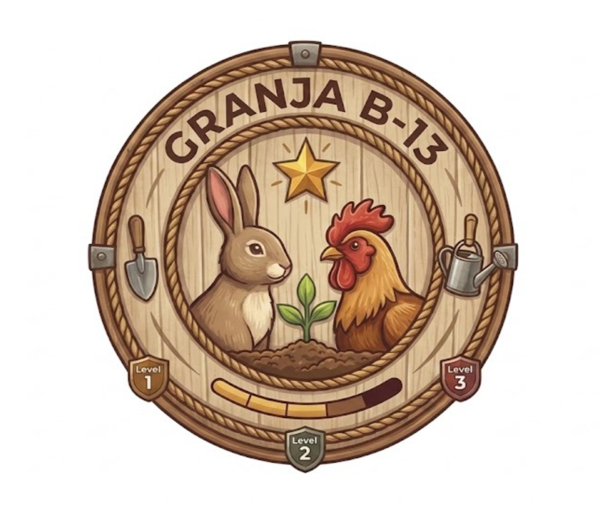

# 🌾 Guía Visual de Uso — La Granja B13 🐓🐇🦜

Esta guía explica de forma visual, clara y didáctica cómo utilizar cada rincón de la plataforma web interactiva **La Granja B13** ([`la-granja-b13.onrender.com`](https://la-granja-b13.onrender.com)), desarrollada para el **Liceo Domingo Herrera Rivera B-13** (Antofagasta) en el marco de la competencia **Go Innova** y alineada con los **ODS 4** (Educación de Calidad) y **ODS 15** (Vida de Ecosistemas Terrestres).

---

<div align="center">
  
</div>

---

## 🧭 1. Navegación Principal (Las 3 Vistas)

En la parte superior de la pantalla se encuentran los botones principales de navegación para moverse entre los diferentes modos:

```
[ 🌾 Potrero ]          → Simulación interactiva con ciclo día/noche y animales libres
[ 🗺️ Mapa de la Granja ] → Exploración espacial de las instalaciones y fauna del liceo
[ 📸 Granja Real B-13 ]  → Galería fotográfica real, carteles oficiales y comparación
```

---

## 🎒 2. Identificación del Estudiante (Cuaderno de Campo)

Antes de iniciar los quizzes o registrar avances, el estudiante debe identificar su sesión:

1. Toca la **píldora de estudiante** con el ícono `🎒` en la barra superior.
2. Ingresa su **Nombre y Apellido** (ej: *Stephany de la Cruz*) y su **Curso** (ej: *2°B*).
3. Presiona **`💾 Iniciar mi Cuaderno de Campo`**.

> **Nota:** La identificación activa el sistema de evaluación individual, guarda automáticamente el puntaje, desbloquea las insignias y calcula las **décimas sugeridas** para el profesor.

---

## 🌾 3. Vista 1: El Potrero (`index.html`)

### 🐾 ¿Qué puedes hacer en el Potrero?
1. **Animales en Movimiento:** Cinco especies (*Gallo, Gallina, Conejo, Catita y Agapornis*) caminan y revolotean de forma autónoma en el prado verde.
2. **Abrir Ficha de Campo:** Toca a cualquier animal para abrir su ficha interactiva con **3 pestañas**:
   - 📖 **Ficha Biológica:** Taxonomía, alimentación, consumo de agua, comportamiento, hábitat, cuidados y **diagrama anatómico con pines interactivos** (toca cada órgano para conocer su función). Además, puedes escuchar su **🔊 Sonido real**.
   - 🎨 **Personalizar:** Permite cambiar el nombre del animal, el color de su etiqueta y añadirle accesorios (sombrerito, flor, etc.).
   - ❓ **Quiz Formativo:** Serie de preguntas de selección múltiple sobre la especie. Al responder correctamente, el animal salta con animación de estrellas ✨ y sonido de victoria 🎉.
3. **🌙 Ciclo Día / Noche:**
   - Toca el botón **`🌙 Noche`** para cambiar el entorno: el cielo se oscurece, aparecen estrellas parpadeantes ⭐, la luna 🌙 y la ventana del granero se ilumina cálidamente.
   - Los animales se acuestan a dormir plácidamente con burbujas de sueño `💤`.
   - Toca **`☀️ Día`** para despertar la granja al amanecer.

---

## 🗺️ 4. Vista 2: El Mapa de la Granja (`mapa.html`)

### 📍 ¿Cómo explorar el Mapa?
1. **Pines Interactivos:** El mapa muestra 11 puntos clave de la granja del liceo:
   - 📦 *Almacén de Granja*
   - 🐇 *Conejeras*
   - 🌱 *Huerto Escolar*
   - 📋 *Pizarrón de Tareas*
   - 🫐 *Huerto de Bayas*
   - 🪣 *Pozo de Agua Limpia*
   - 🌳 *Arboleda de Nidos*
   - 🐔 *Gallinero*
   - 🐓 *Jaula del Gallo*
   - 🌾 *Zona de Paja y Cama*
   - 🐈 *Gato Guardián*
2. **Zonas con Animales (Pines con huella 🐾):**
   - Al tocar zonas como las *Conejeras* o el *Gallinero*, se abre una **cuadrícula de retratos** con los animales reales del colegio (*Vainilla, Nesquik, Tasmi, Quesito, Matías y Vicente*).
   - Cada animal abre su propia ficha de aprendizaje con quiz formativo específico.
3. **Zonas de Infraestructura (Pines descriptivos):**
   - Muestran datos formativos sobre la importancia del agua limpia, el almacenamiento seco de forraje o la agricultura urbana escolar.

---

## 📸 5. Vista 3: Granja Real B-13 (`galeria-real.html`)

Esta vista conecta el mundo digital con la **realidad física del Liceo B-13**, presentando el registro fotográfico de las instalaciones y los carteles de los animales:

### 🔍 Funcionalidades de la Galería:
* **Filtros Temáticos:** Filtra al instante por `🌿 Todos`, `🐰🐔 Fauna y Carteles`, `🌱 Huerto e Invernadero`, `🏗️ Espacios y Hábitats` y `🥚 Nidos y Postura`.
* **Botón `🎮 En el juego`:** Cada ficha fotográfica indica a qué rincón del videojuego corresponde y te permite viajar hasta allí con un clic.
* **Visor Lightbox:** Toca cualquier foto para ampliarla a pantalla completa con su descripción pedagógica.
* **Carteles Oficiales:** Fichas de identidad de los 4 conejos (*Vainilla, Nesquik, Tasmi, Quesito*) y de los gallitos (*Matías y Vicente*).

---

## 🏆 6. Sistema de Insignias y Logros

Al final de cada página se encuentra la **barra de logros (grilla 2x3)**. Toca cualquier insignia para consultar los requisitos y desbloquearla:

| Insignia | Nombre | Desafío para Desbloquear |
|:---:|---|---|
| 🧭 | **Explorador/a de la Granja** | Abre y descubre la ficha de los 5 animales del Potrero. |
| 📓 | **Cuaderno de Campo** | Responde y completa tu primer quiz formativo con éxito. |
| 🛡️ | **Guardián/a Responsable** | Completa los quizzes de todas las especies del Potrero. |
| ⭐ | **Precisión Perfecta** | Obtén un 100% de respuestas correctas en cualquier quiz. |
| 🔎 | **Zoólogo/a de Campo** | Explora y descubre los 10 animales reales en el Mapa. |
| 🩺 | **Veterinario/a de la Granja** | Completa todos los quizzes del Mapa de la Granja. |

---

## 👩‍🏫 7. Panel Docente y Evaluación Formativa

Al presionar el botón **`👩‍🏫 Panel docente`**, profesores y evaluadores acceden a:

1. **Resumen Formativo:** Puntaje total acumulado y conteo de fichas y quizzes aprobados.
2. **Décimas Sugeridas:** Cálculo automático de décimas académicas según el desempeño en los quizzes para la asignatura de Ciencias/Biología.
3. **Tablas de Progreso Detalladas:** Estado individual de cada animal (*No iniciado*, *En progreso* o *✅ Correctas*).
4. **Selector Multi-Estudiante:** Permite revisar y cambiar de perfil entre todos los alumnos que hayan trabajado en ese dispositivo.
5. **Acciones de Exportación:**
   - **`⬇️ Descargar informe oficial (.txt)`**: Genera un documento de texto firmado listo para archivar o imprimir.
   - **`👤 Registrar nuevo estudiante`**: Abre el formulario para iniciar la sesión del siguiente alumno.
   - **`🔄 Reiniciar datos locales`**: Restablece los datos del navegador con confirmación previa.
